<h1> Super Cashier Project </h1>
Super Cashier Sederhana yang dibuat menggunakan bahasa pemerograman python 

<h3> Latar Belakang Problem </h3>
Terdapat perusahaan supermarket besar yang terkenal di kota Malang, owner berpikir untuk memperluas marketnya dengan memudahkan pelanggannya agar tidak perlu langsung datang ke supermarket untuk membeli produknya. Owner perusahaan ingin meningkatkan perusahaannya dengan cara membuat sistem kasir yang lebih modern dan nantinya customer dapat membeli barang tersebut dari jarak jauh. Owner berkeinginan customer dapat memasukan nama pesanan, jumlah pesanan, dan harga pesanan. Maka owner tersebut mencari programmer untuk membuatkan sistem yang disebut "self-service" agar keinginannya tercapai. Dari latar belakang problem tersebut maka project ini dibuat untuk kebutuhan supermarket.

<h3> Tujuan Pengerjaan Project (requirements) </h3>
Membuat sistem kasir sederhana yang dapat melakukan : 

</li><li> Membuat inputan oleh user : nama pesanan, jumlah pesanan, dan harga pesanan 
</li><li> Membuat inputan pengecekan pesanan oleh user : Menambahkan, mengganti, dan membatalkan pesanan
</li><li> Mengoreksi pesanan oleh user : Menghapus 1 baris atau lebih (rows) berdasarkan index
</li><li> Menghapus semua pesanan oleh user jika ingin dibatalkan atau memesan ulang
</li><li> Menampilkan pesanan yang telah dibuat oleh user
</li><li> Pengecekan diskon yang didapatkan oleh user

<h3> Alur Program / FlowChart </h3>
    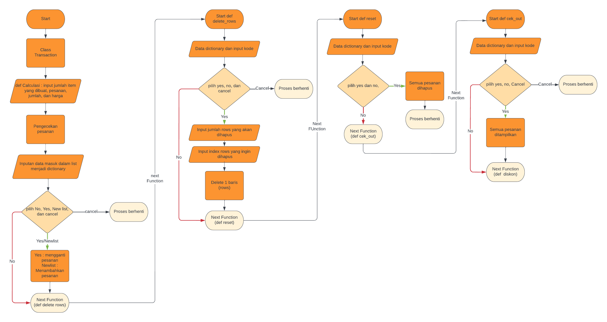
    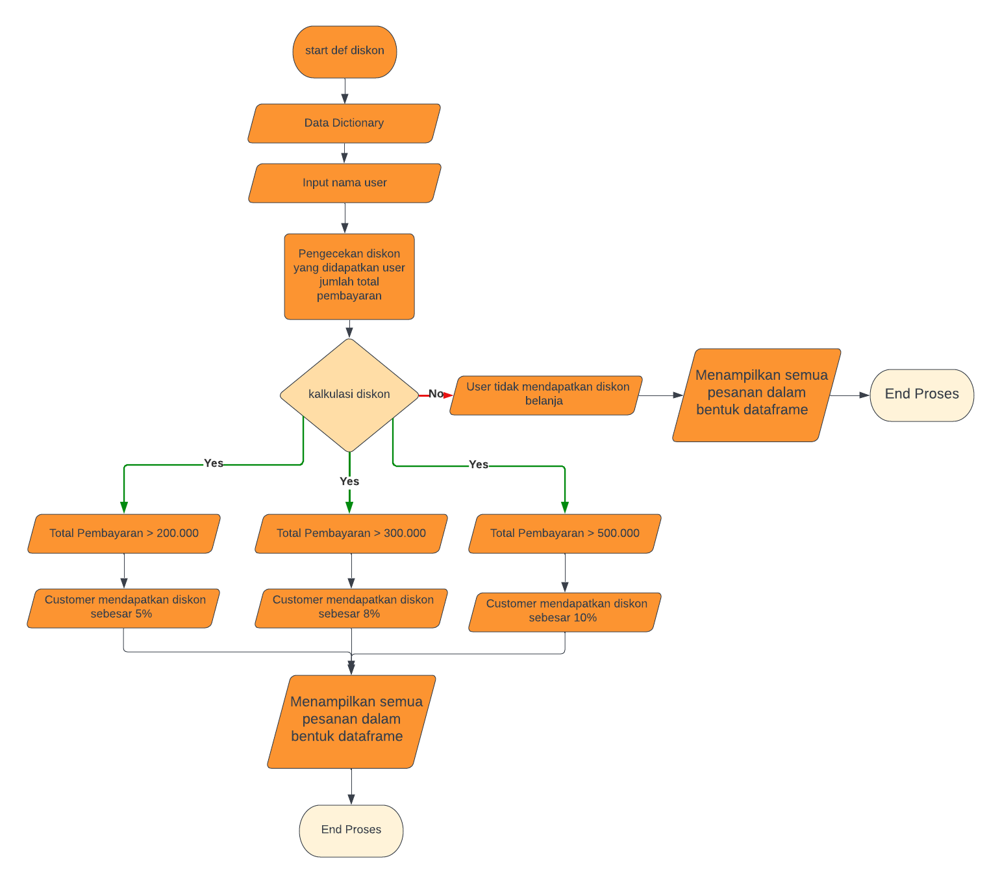

<h3> Penjelasan Code!</h3>
</li><li> Class Transaction untuk mencangkup semua function program

   "Class Transaction(object):"

</li><li> Function calculasi memberikan user memilih untuk memasukan pesanan, menghapus pesanan, menambahkan pesanan, pengecekan pesanan atau membatalkan pesanan sesuai kode yang disediakan dan jumlah proses yang diinginkan, jika kode yang dimasukan salah maka user diminta validasi kode hingga benar dan jika ingin membatalkan proses user dapat pilih "cancel" lalu proses berhenti. data tersebut dimasukan ke dalam list yang sudah disediakan sebelumnya, kemudian list tersebut dibuat ke dalam dictionary dan mengubahnya ke dalam bentuk dataframe.

    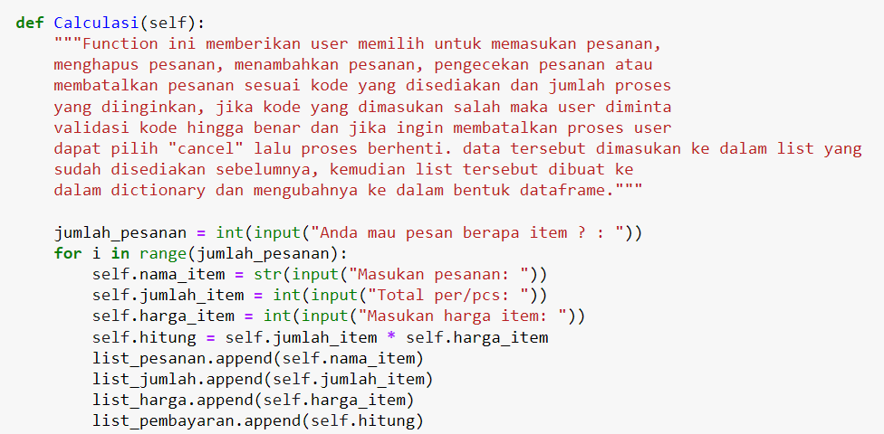

 
    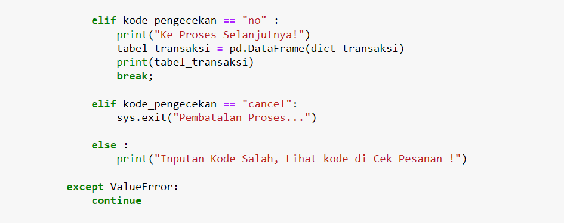

</li><li> Function delete_rows bertujuan untuk melakukan penghapusan oleh user dengan cara memilih row sesuai jumlah yang diinginkan dan bisa juga tidak dihapus. 
Jika user ingin membatalkan pesanan dapat memilih "cancel" lalu proses berhenti.

    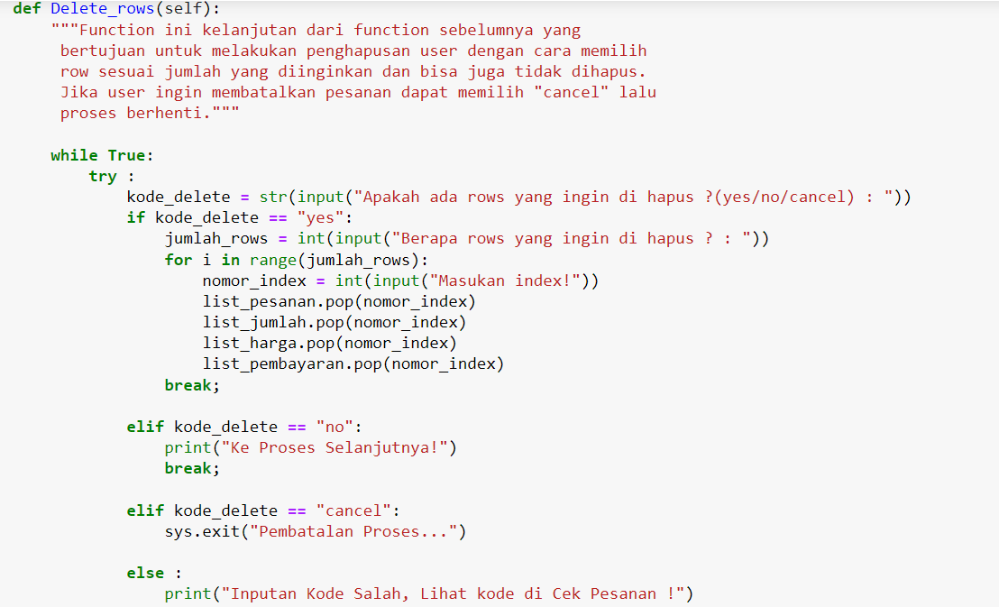

</li><li> Function reset yang bertujuan untuk reset semua pesanan dan automatis proses berhenti.

    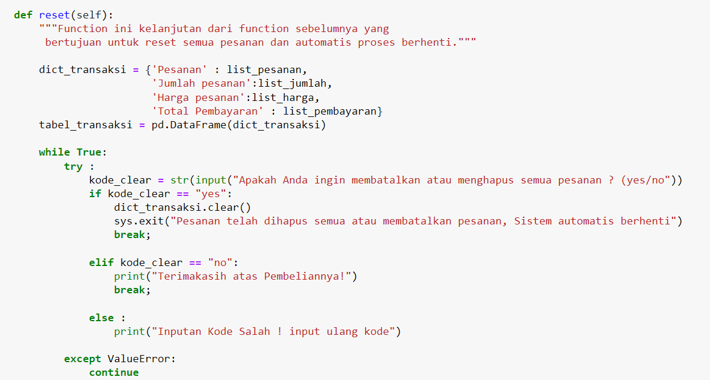

    
</li><li> Function ini kelanjutan dari function sebelumnya yang bertujuan untuk melihat pesanan user yang telah dibuat.

    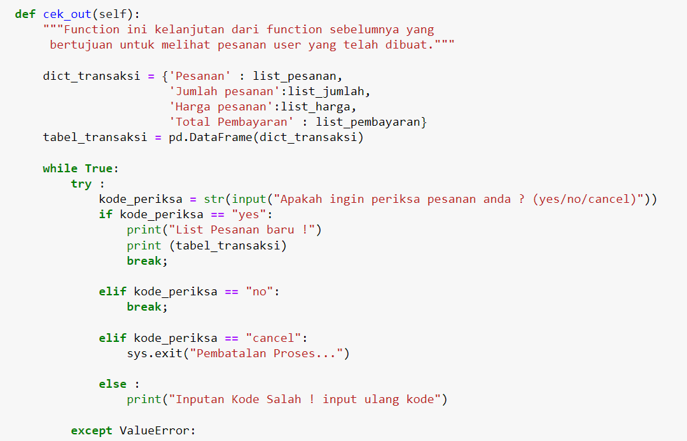

    
</li><li> Function ini bertujuan untuk melihat apakah user mendapatkan diskon? proses perhitungannya jumlahkan semua kolom pada tabel(pembayaran) lalu hasil tersebut dimasukan kedalam variabel baru = Total_belanja. Jika pesanan > 200_000 maka diskon 5%, pesanan > 300_000 maka diskon 8%, dan pesanan > 500_000 diskon 10%. Perhitungannya yaitu Total harga pesanan * diskon, kemudian hasilnya di kurangkan dengan total harga sebelumnya.

    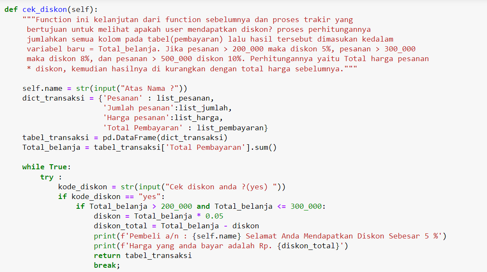

    

<h3> Cara menjalankan program </h3>
</li><li> Download semua modul python 
</li><li> Gunakan jupyter Notebook atau semacamnya yang mendukung file
</li><li> Jika menjalankan menggunakan modul, upload modul terlebih dahulu di jupyter atau semacamnya. Kemudian ketik import transaksi dan run program untuk menjalankan. Jika menjalankan menggunakan codingan jupyter langsung run program.

<h3> Hasil Test Case </h3>
<ul></li><li> Pertama sistem akan menawarkan pada user ingin belanja berapa jenis item ?, kemudian user diminta untuk memasukan nama pesanan, jumlah, dan harga sesuai keinginan user sebelumnya yang nantinya jumlah dan harga akan dikalkulasi menjadi total pembayaran per.item

    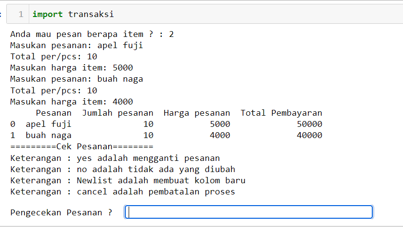

 
</li><li> Kedua sistem menawarkan pengecekan ke user terdapat beberapa pilihan kode yaitu : (yes, no, Newlist, dan cancel) jika kode yang dimasukan user salah maka sistem akan meminta validasi user untuk input kode hingga benar .

    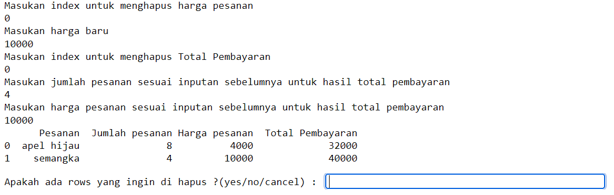
 
<ul id="tabbar"> 
    <li data-item="tab-one tab-active" data-initial="true"> Pilihan yes : sistem akan mengganti pesanan berdasarkan index dan berapa pesanan yang ingin             diganti? Disini user diminta memilih index yang ingin dihapus terlebih dahulu lalu input pesanan baru dan index yang dimasukan dimulai dari index terbesar           hingga terkecil.

    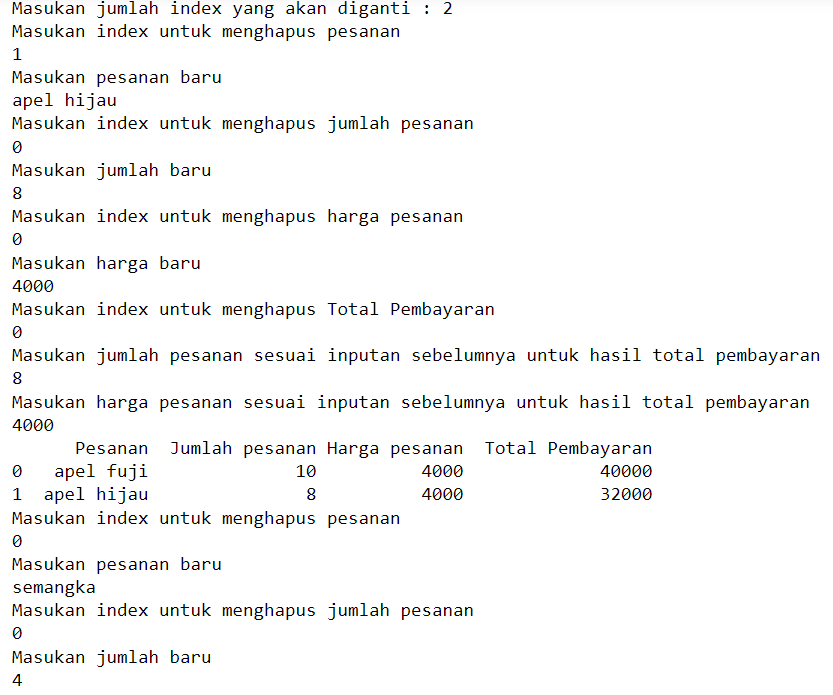
    <li data-item="tab-two"> Pilihan Newlist : Sistem akan menambahkan pesanan baru sesuai permintaan user (disini dapat lebih dari 1 tambahan list).

    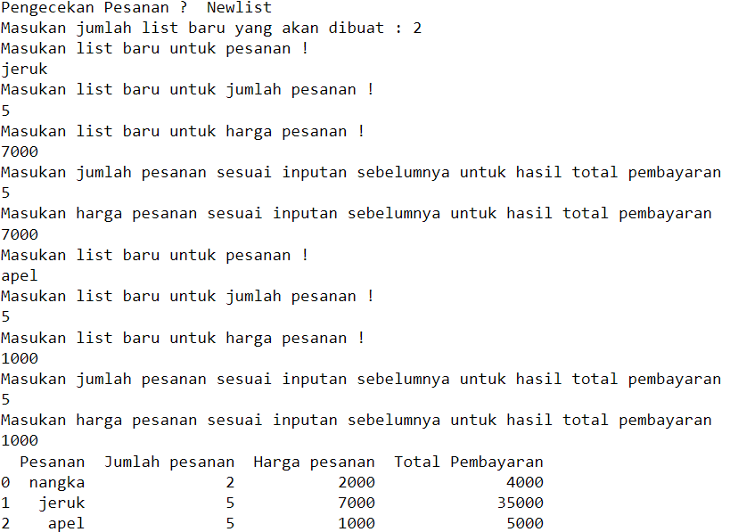 
    <li data-item="tab-two"> Pilihan no : Sistem akan lanjut ke proses selanjutnya
    <li data-item="tab-two"> Pilihan cancel : Pesanan akan dibatalkan dan sistem akan berhenti, untuk menjalankan kembali perlu dilakukan run ulang.
</ul>

</li><li> Ketiga, sistem akan menawarkan apakah user ingin menghapus 1 baris pesanan atau tidak jika ya maka user diminta row berapa atau index berapa yang mau dihapus, jika memilih no ke proses selanjutnya

</li><li> Keempat, Sistem akan menawarkan apakah mau mengahapus semua kolom pesanan? jika ya maka kolom akan terhapus semua dan sistem akan berhenti
</li><li> Kelima, Sistem menawarkan apakah ingin melihat pesanan saat ini? jika ya, maka akan menampilkan data pesanan dan jika tidak maka ke proses selanjutnya
</li><li> keenam, Sistem akan mengkalkulasi apakah total belanja user mendapatkan diskon? 

